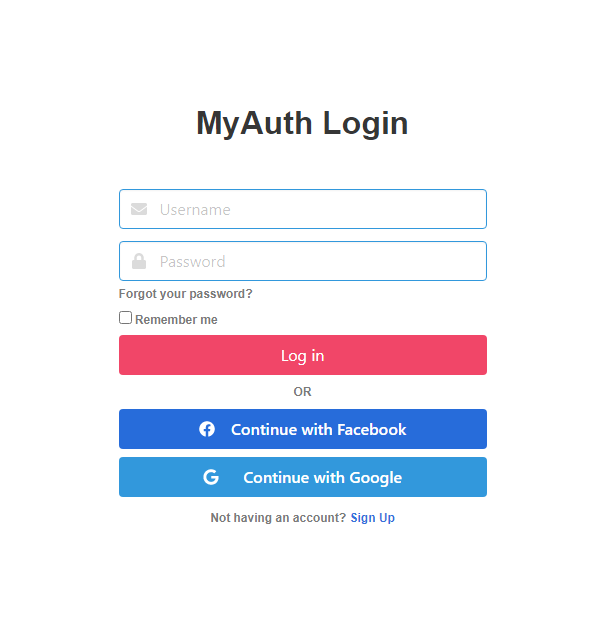

# MyAuth
 
  ](https://codecov.io/gh/ts-dave/myauth) [PyPI - Python Version](https://img.shields.io/pypi/pyversions/django)

### Features
* Sign up
* Login
* Logout
* Email Verification
* Reset Email and Password
* Social Login (Google, Facebook)
* [TODO] - Override django-allauth templates

## Prerequisites
* python >= 3.7
* Django == 3.1.7
* django-allauth == 0.44.0
## Contributors
* [@ts-dave](https://github.com/ts-dave)

## Contact
You can contact me via email at [emsonjunior@gmail.com](emsonjunior@gmail.com).

## License
This project uses the [MIT License](https://opensource.org/licenses/MIT)
